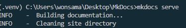

# 설치 및 실행 (Python)

## 기본내용 작성

> 최소 구성으로 `mkdocs` 를 실행하기 위한 폴더 및 파일을 아래와 같이 생성합니다.

### 폴더 및 파일

```tree
mkdocs
L docs
__L index.md
L mkdocs.yml
```

- docs : 문서를 작성할 폴더, \*.md 파일을 작성하여 문서를 작성합니다.
- mkdocs.yml : mkdocs 설정 파일

### index.md

```markdown
# Hello, MkDocs!
```

### mkdocs.yml

```yaml
site_name: My Docs
nav:
  - Home: index.md
```

## 가상환경

> venv 를 사용하여 가상환경을 생성하고, 필요한 패키지를 설치합니다. ( conda, pyenv 등을 사용하여도 무방함 )

### 가상환경 생성

```bash
# 가상환경 생성
python -m venv .venv
```

### 가상환경 활성화

```bash
# 가상환경 활성화
.venv\Scripts\activate
```

### 가상환경 비활성화

```bash
# 가상환경 비활성화
deactivate
```

## 패키지 설치 및 실행

### python 패키지 설치

( vscode - windows 의 경우 아래와 같이 실행)

`terminal - cmd` 선택 후, 가상환경 생성 및 활성화를 진행한다


```bash
# 가상환경 생성
python -m venv .venv

# 가상환경 활성화
.venv\Scripts\activate

# mkdocs 패키지 설치
pip install mkdocs-material

# 추가 패키지 설치
pip install mkdocs-macros-plugin
pip install mkdocs-glightbox
```

### 패키지 설치 확인

아래 그림과 같이 Script 하위 mkdocs 명령어가 생성된 것을 확인할 수 있다.


### mkdocs 실행

```bash
# mkdocs 실행
mkdocs serve
```



## 접속확인

[http://localhost:8000](http://localhost:8000){:target="\_blank"} 에 접속하여 `Hello, MkDocs!` 가 표시되는지 확인합니다.
