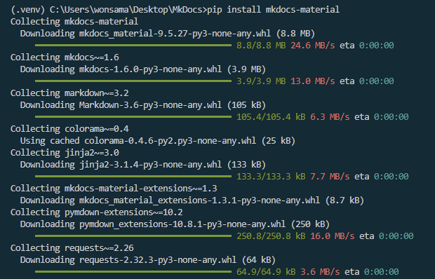
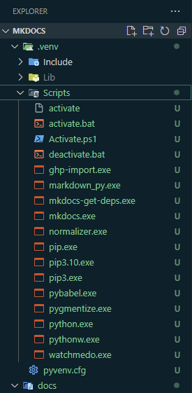

# 설치

## 가상환경

( vscode - windows 의 경우 아래와 같이 실행)

`terminal - cmd` 선택 후, 가상환경 생성 및 활성화를 진행한다

---

아래 그림과 같이 Script 하위 mkdocs 명령어가 생성된 것을 확인할 수 있다.

### 가상환경 생성

`python -m venv .venv`

### 가상환경 활성화

`.venv\Scripts\activate`

### 가상환경 비활성화

`deactivate`
