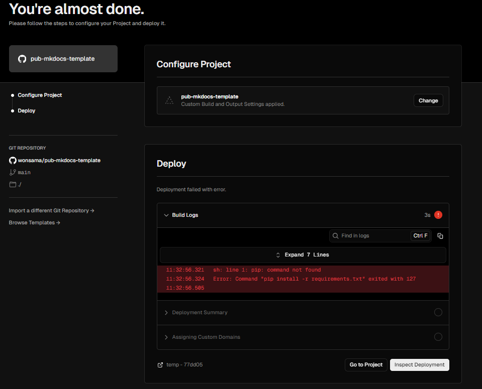
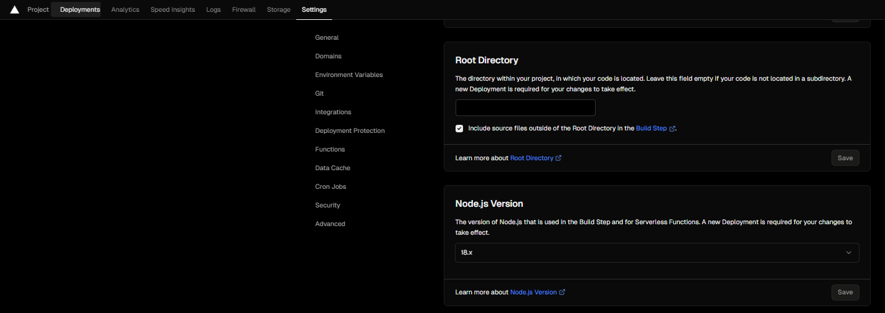

# 배포 ( Vercel )

Vercel 에서는 정적 사이트 배포를 지원합니다. 또한 Github 저장소 등과 연동하여 손쉽게 배포를 진행할 수 있습니다.

## 사전준비

- Github 계정이 있고, 원격 저장소를 생성해야 됨 ([github : pub-mkdocs-template](https://github.com/new?template_name=pub-mkdocs-template&template_owner=wonsama)를 통해 손쉽게 생성)
- Vercel 계정이 있어야 함 ([Vercel](https://vercel.com/))

## 배포하기

### 1. 저장소 연동

`Vercel` 에서 `Overview` 에서 `Import Project` 를 선택하여 `Github 저장소` 를 연동합니다.

### 2. 프로젝트 설정

- `Build command` : `mkdocs build` 로 설정하고 Override를 선택
- `Output directory` : `site` 로 설정하고 Override를 선택
- `Install Command` : `pip install -r requirements.txt` 로 설정하고 Override를 선택
- `Save` 를 선택하여 설정을 저장합니다.
- 배포가 이뤄지지만, pip 커맨드 실행이 실패할 것입니다.

### 3. NodeJS 버전 변경

`Settings` 에서 `Node.js Version` 에서 `18.x` 를 선택 후 `Save` 를 선택하여 설정을 저장합니다.

### 4. 배포

- `Deployments` 탭을 선택하여 이전에 실패한 배포를 `redeploy` 를 선택하여 다시 배포합니다.

## 참조링크

- [mkdocs-material : publishing-your-site](https://squidfunk.github.io/mkdocs-material/publishing-your-site/)
- [deploy-mkdocs-material-vercel](https://www.starfallprojects.co.uk/projects/deploy-host-docs/deploy-mkdocs-material-vercel/)
