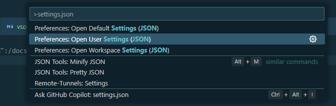

# VSCODE 설정

## Extensions 설치

yaml 문법을 지원하기 위해 [vscode-yaml](https://marketplace.visualstudio.com/items?itemName=redhat.vscode-yaml){:target="\_blank"} 링크를 눌러 확장팩을 설치 합니다.

## settings.json 설정



mkdocs.yml 의 문법을 지원하기 위해 `user` 또는 `workspace` 설정에 아래 내용을 추가합니다.

```json
{
  "yaml.schemas": {
    "https://squidfunk.github.io/mkdocs-material/schema.json": "mkdocs.yml"
  },
  "yaml.customTags": [
    "!ENV scalar",
    "!ENV sequence",
    "!relative scalar",
    "tag:yaml.org,2002:python/name:material.extensions.emoji.to_svg",
    "tag:yaml.org,2002:python/name:material.extensions.emoji.twemoji",
    "tag:yaml.org,2002:python/name:pymdownx.superfences.fence_code_format"
  ]
}
```
